# 🚀 MEAN App — Containerized & CI/CD Deployment

> **crud-dd-task-mean-app** — A full-stack MEAN (MongoDB · Express · Angular · Node) application containerized with Docker Compose, published to Docker Hub, and deployed on an AWS EC2 Ubuntu VM via GitHub Actions CI/CD. Nginx serves as the reverse proxy on port 80.

---

## 📑 Table of Contents

1. [Repository Layout](#repository-layout)
2. [Quick Start (run locally)](#quick-start-run-locally)
3. [Build & Push Images](#build--push-images-ci-or-locally)
4. [Deploy on EC2 / Ubuntu VM](#deploy-on-ec2--ubuntu-vm)
5. [Nginx Reverse-Proxy Config](#nginx-reverse-proxy-config)
6. [CI/CD Workflows & Required Secrets](#cicd-workflows--required-secrets)
7. [Screenshots / Evidence](#screenshots--evidence)
8. [Troubleshooting & Common Fixes](#troubleshooting--common-fixes)
9. [Commands Cheat Sheet](#commands-cheat-sheet)
10. [Interview / Demo Checklist](#interview--demo-checklist)
11. [Appendix — Production docker-compose.yml](#appendix--example-production-docker-composeyml)

---

## Repository Layout

```
mean-devops-assignment/          ← project root
├── backend/                     # Node + Express (server.js, Dockerfile)
├── frontend/                    # Angular app (ng project, Dockerfile)
├── docker-compose.yml           # Compose file used on the VM (image-based)
├── .github/
│   └── workflows/
│       ├── build.yml            # Build images & push to Docker Hub
│       └── deploy.yml           # SSH to VM → pull & restart Compose stack
├── screenshots/                 # CI, Docker, and UI evidence images
└── README.md
```

---

## Quick Start (run locally)

Use this to test the full stack on your local machine.

```bash
# Build and start all services
docker compose up --build -d

# Fresh build (no cache)
docker compose down -v
docker compose build --no-cache
docker compose up -d

# Inspect running containers and logs
docker ps
docker logs mean-backend  -f
docker logs mean-frontend -f
docker logs mongodb       -f
```

**App endpoints (local):**

| Service | URL |
|---------|-----|
| Frontend (dev server) | `http://localhost:8081` |
| Backend API | `http://localhost:8080/api/...` |

> ⚠️ **Do not hardcode `http://localhost:8080`** in the Angular frontend for production. Use relative paths (`/api/...`) so Nginx can proxy the request — this also eliminates CORS issues entirely.

---

## Build & Push Images (CI or locally)

### Via GitHub Actions (recommended)

Push to `main` — the `build.yml` workflow builds both images and pushes them to Docker Hub automatically.

### Locally

```bash
# Backend
docker build -t thakurkaran007/mean-backend:latest ./backend
docker push  thakurkaran007/mean-backend:latest

# Frontend (production multi-stage build)
docker build -t thakurkaran007/mean-frontend:latest ./frontend
docker push  thakurkaran007/mean-frontend:latest
```

### Force the VM to always use the latest image

```bash
sudo docker compose up -d --pull always --force-recreate
# — or —
sudo docker compose pull
sudo docker compose up -d
```


---

## Deploy on EC2 / Ubuntu VM

### 1 — Provision the VM

```bash
sudo apt update
sudo apt install -y docker.io docker-compose
sudo systemctl enable --now docker
```

### 2 — Clone the repository

```bash
git clone https://github.com/<your-username>/crud-dd-task-mean-app.git
cd crud-dd-task-mean-app
```

### 3 — Start the stack

```bash
sudo docker compose up -d --pull always --force-recreate
```

### 4 — Validate

```bash
sudo docker ps                           # all containers running?
curl http://localhost:8080/api/tutorials # backend health check
curl http://localhost:8081               # frontend health check
```

If Nginx is configured on the host, browse to `http://<EC2-PUBLIC-IP>` to access the full app.

---

## Nginx Reverse-Proxy Config

Place this in `/etc/nginx/nginx.conf` (or inside an Nginx container as `nginx.conf`):

```nginx
server {
    listen 80;

    # Serve Angular production build (static files)
    location / {
        root       /var/www/frontend/dist;   # adjust to your dist path
        try_files  $uri $uri/ /index.html;

        # — OR — proxy to a running frontend container:
        # proxy_pass http://localhost:8081;
    }

    # Proxy API requests to the Node/Express backend
    location /api/ {
        proxy_pass         http://localhost:8080;
        proxy_http_version 1.1;
        proxy_set_header   Host              $host;
        proxy_set_header   X-Real-IP         $remote_addr;
        proxy_set_header   X-Forwarded-For   $proxy_add_x_forwarded_for;
    }
}
```

> See `screenshots/nginxconf.png` for the actual config file used in deployment.

---

## CI/CD Workflows & Required Secrets

### Workflows

| File | Trigger | What it does |
|------|---------|-------------|
| `build.yml` | Push to `main` | Builds backend & frontend images, pushes to Docker Hub |
| `deploy.yml` | After build succeeds | SSH to EC2 VM, pulls latest images, restarts Compose stack |

### Required GitHub Secrets

Go to **Settings → Secrets → Actions** and add:

| Secret | Value |
|--------|-------|
| `DOCKER_USERNAME` | Your Docker Hub username |
| `DOCKER_PASSWORD` | Docker Hub password or access token |
| `SSH_HOST` | EC2 public IP address |
| `SSH_USERNAME` | SSH user (e.g. `ubuntu`) |
| `SSH_KEY` | Private key contents for SSH access |

---

## Screenshots / Evidence

### ✅ CI Checks

**CI Check 1**
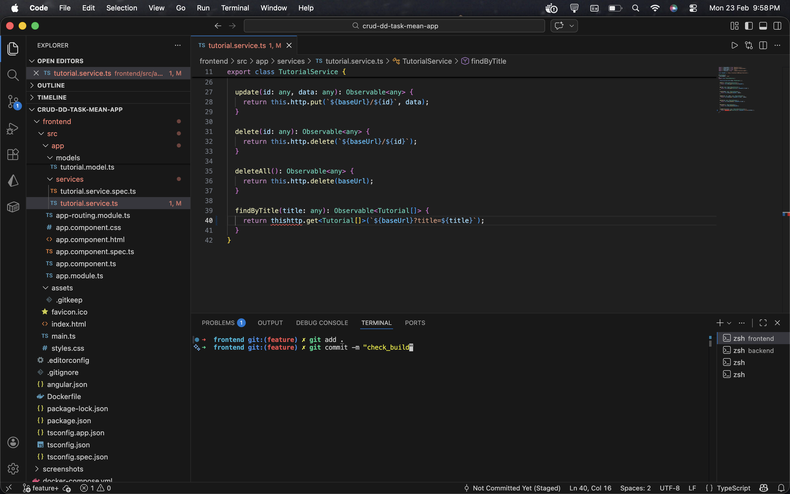

**CI Check 2**
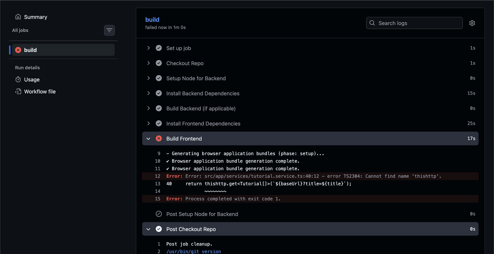

**CD Confirmed**
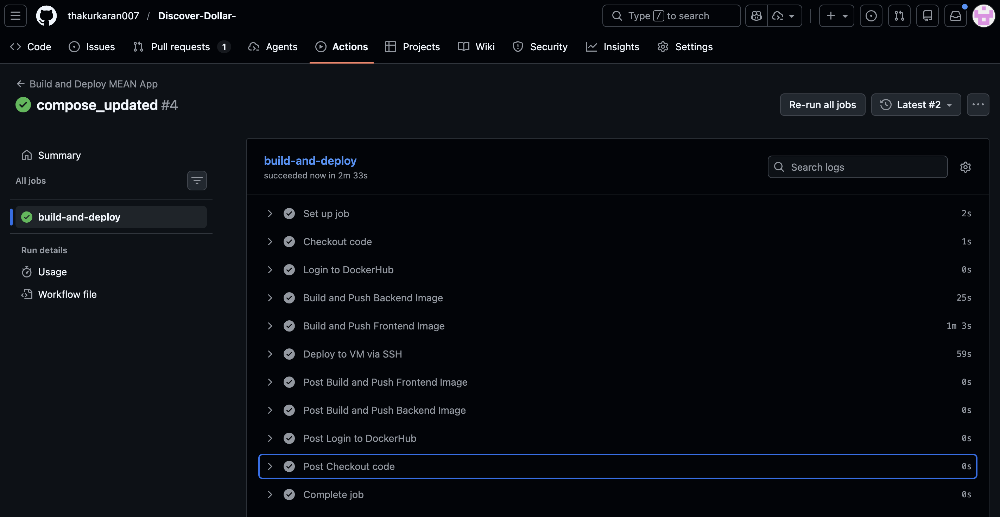

---

### 🐳 Docker Build — Backend

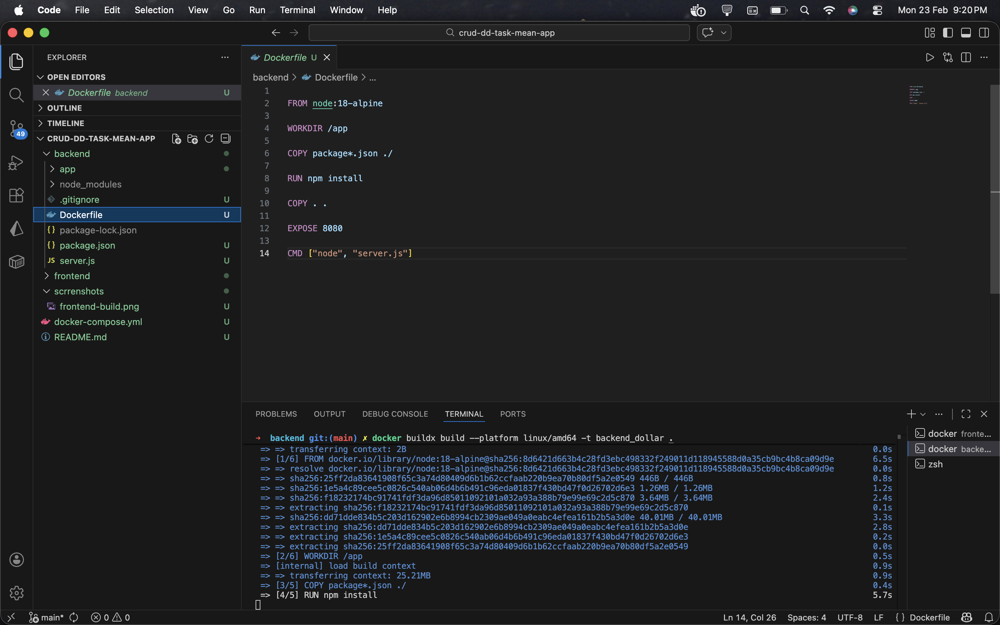

### 🐳 Docker Build — Frontend

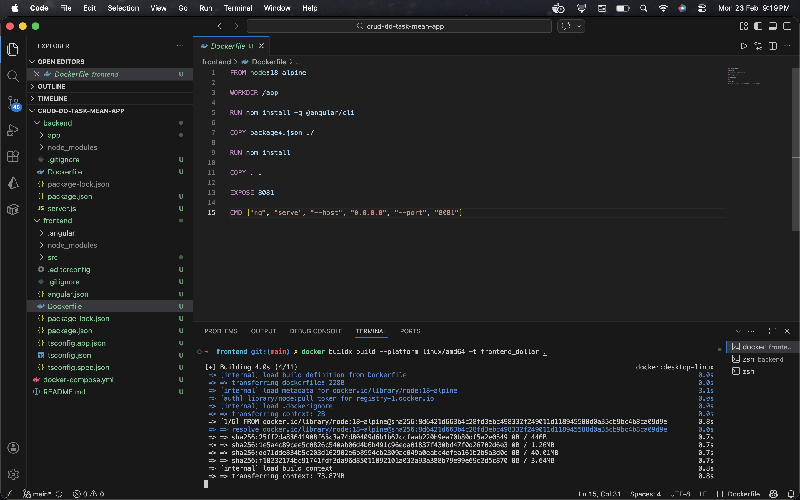

---

### 📦 Docker Hub Push — Backend

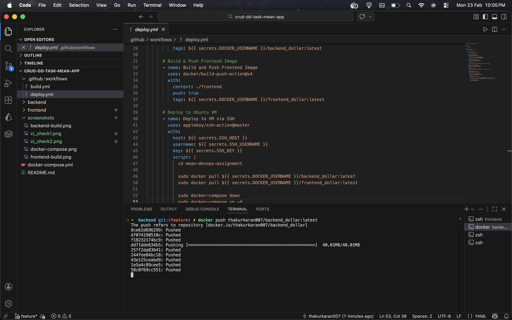

### 📦 Docker Hub Push — Frontend

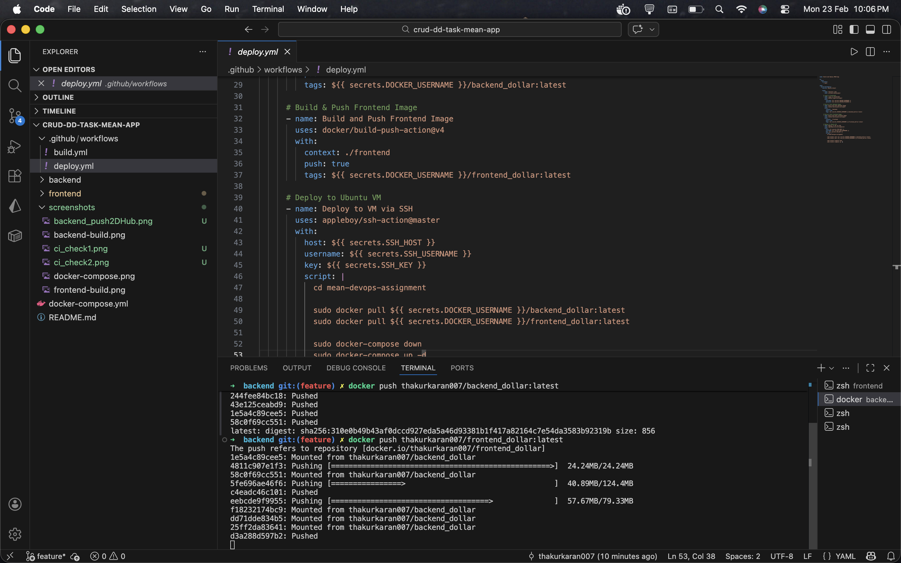

---

### 🚀 Deployment

**Deploy Step (SSH & Compose restart)**
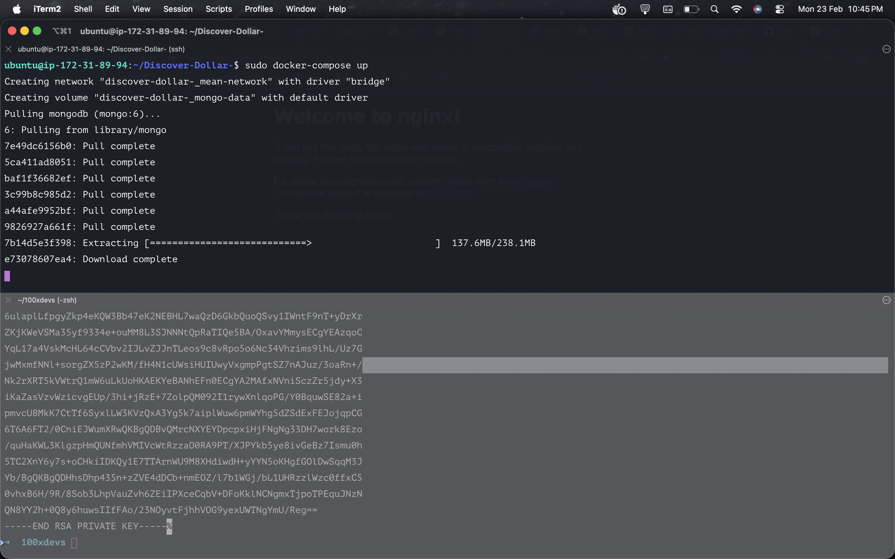

**Docker Compose Up on VM**
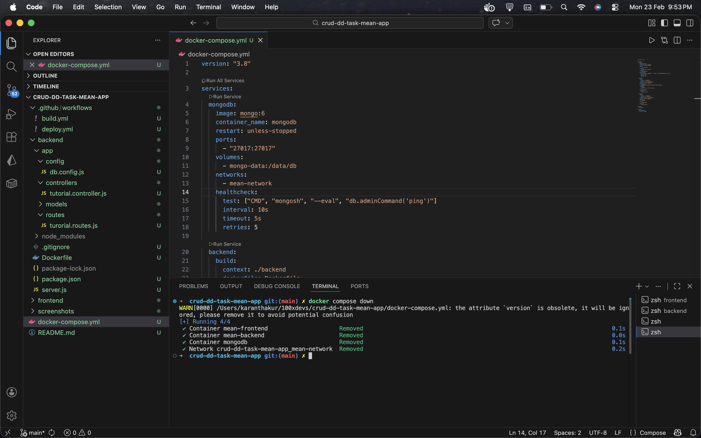

---

### 🌐 Nginx Config

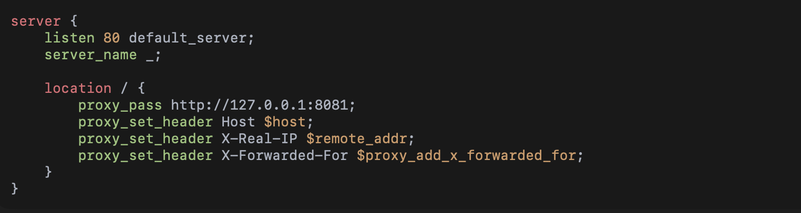

---

### 🖥️ App UI

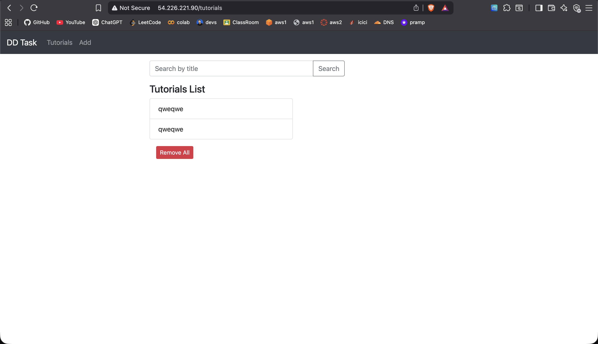

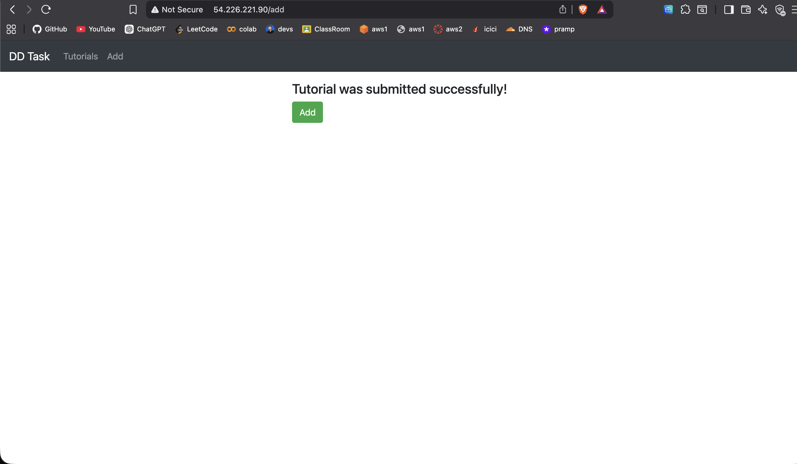

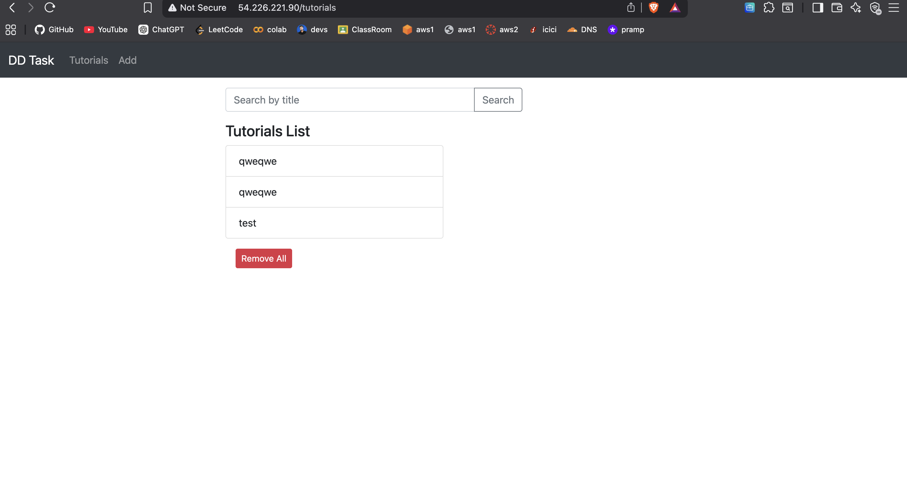

---

## Troubleshooting & Common Fixes

### Backend cannot connect to MongoDB

**Cause:** `MONGO_URI` not set, or hardcoded to `localhost` inside the container.

**Fix:** Ensure `docker-compose.yml` sets the environment variable, and that the backend reads `process.env.MONGO_URI` with no hardcoded fallback.

```yaml
environment:
  - MONGO_URI=mongodb://mongodb:27017/meanapp
```

```bash
sudo docker compose down -v
sudo docker compose build --no-cache
sudo docker compose up -d
```

---

### Browser shows `ERR_CONNECTION_RESET` or status 0

The backend container most likely crashed — often due to a failed DB connection triggering `process.exit()`.

```bash
sudo docker logs mean-backend -f
```

---

### Webpack / WebSocket errors in production

**Cause:** `ng serve` (the dev server) is running in production — it is not designed for it.

**Fix:** Build the production bundle and serve via Nginx or `serve`:

```bash
cd frontend
ng build --configuration production
# Copy dist/ to Nginx root, or use a multi-stage Dockerfile
```

---

### CORS issues

If frontend and backend are served through the same Nginx domain, CORS is not needed. If they are on different origins, enable CORS on the backend:

```js
const corsOptions = { origin: "http://<EC2-PUBLIC-IP>" };
app.use(cors(corsOptions));
```

---

## Commands Cheat Sheet

```bash
# Build & run locally
docker compose up --build -d

# Pull latest images and force-recreate (VM)
sudo docker compose up -d --pull always --force-recreate

# Clean rebuild from scratch
sudo docker compose down --rmi all -v
sudo docker compose build --no-cache
sudo docker compose up -d

# Logs
sudo docker logs -f mean-backend
sudo docker logs -f mean-frontend
sudo docker logs -f mongodb

# Inspect networking & volumes
docker network ls
docker volume ls
docker volume inspect <volume-name>
```

---

## Interview / Demo Checklist

- ✅ **GitHub Actions on push** — show `ci_check1.png`, `ci_check2.png`
- ✅ **Docker Hub images** — show `frontend_push2DHub.png`, `backend_push2DHub.png`
- ✅ **EC2 deployment** — show `deploy1.png`, `docker-compose.png`
- ✅ **App UI in browser** — show `UI_1.png`, `UI_2.png`, `UI_3.png`
- ✅ **Nginx routing** — show `nginxconf.png`; explain `/` → frontend, `/api` → backend
- ✅ **End-to-end flow** — push to `main` → CI builds & pushes → deploy workflow pulls & restarts on VM

---

## Appendix — Example Production docker-compose.yml

```yaml
version: "3.8"

services:
  mongodb:
    image: mongo:6
    container_name: mongodb
    restart: unless-stopped
    ports:
      - "27017:27017"
    volumes:
      - mongo-data:/data/db
    networks:
      - mean-network
    healthcheck:
      test: ["CMD", "mongosh", "--eval", "db.adminCommand('ping')"]
      interval: 10s
      timeout: 5s
      retries: 5

  backend:
    image: thakurkaran007/backend_dollar:latest 
    container_name: mean-backend
    restart: unless-stopped
    environment:
      - MONGO_URI=mongodb://mongodb:27017/meanapp
      - FRONTEND_URL=http://54.226.221.90
    depends_on:
      mongodb:
        condition: service_healthy
    ports:
      - "8080:8080"
    networks:
      - mean-network

  frontend:
    image: thakurkaran007/frontend_dollar:latest 
    container_name: mean-frontend
    restart: unless-stopped
    depends_on:
      - backend
    ports:
      - "8081:8081"
    networks:
      - mean-network

volumes:
  mongo-data:

networks:
  mean-network:
    driver: bridge
```
---